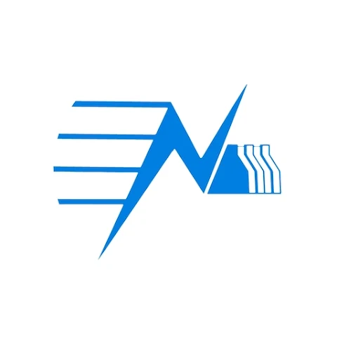

# 🇳🇵 Awesome Nepali Flutter Apps
Flutter has rapidly become one of the most popular frameworks for building cross-platform mobile apps.  
This repository highlights **Nepali-made apps built with Flutter**.

Whether you're a **developer looking for inspiration** or just curious about what’s being built in Nepal, this repo is for you. 🚀  

## Education

| Logo | App Name | Description | Download Links |
|------|----------|-------------|----------------|
|  | **Nepal Quest** | Comprehensive information on Nepal’s constitution, provinces, districts, municipalities, and general facts along with engaging map-based games. | [Play Store](https://play.google.com/store/apps/details?id=np.com.shrestharanjit.nepalquest) |
|  | **Mero School** | Online learning platform | [Play Store](https://play.google.com/store/apps/details?id=school.mero.lms)   [App Store](https://apps.apple.com/np/app/mero-school/id1581089279) |

## Finance And Banking

| Logo | App Name | Description | Download Links |
|------|----------|-------------|----------------|
|  | **Khalti** | Digital wallet for online payments, recharges, and money transfers | [Play Store](https://play.google.com/store/apps/details?id=com.khalti)   [App Store](https://apps.apple.com/us/app/khalti-digital-wallet-nepal/id1263400741) |
|  | **NIMB Smart Banking** | Mobile banking app for Nepal Investment Mega Bank customers | [Play Store](https://play.google.com/store/apps/details?id=com.f1soft.megafonebank.activities.starter)   [App Store](https://apps.apple.com/us/app/nimb-smart/id901814671) |
|  | **Money Mitra** | All-in-one solution for personal finance management, stock analysis, financial planning, and soft skills courses. | [Play Store](https://play.google.com/store/apps/details?id=com.ideapreneurnepal.moneymitra)   [App Store](https://apps.apple.com/ne/app/money-mitra/id6446030380) |
|  | **Sharehub** | NEPSE portfolio app offering real-time market data, alerts, IPO tracking | [Play Store](https://play.google.com/store/apps/details?id=com.softshalanepal.sharehub)   [App Store](https://apps.apple.com/us/app/share-hub-nepse-information/id1567874669) |

##  Government and Public Services

| Logo | App Name | Description | Download Links |
|------|----------|-------------|----------------|
|  | **Nagarik App** | Unified government services (e-Chalan, PAN, police clearance, etc.) | [Play Store](https://play.google.com/store/apps/details?id=com.yajtech.nagarikapp)   [App Store](https://apps.apple.com/us/app/nagarik-app/id1493013430) |
|  | **NEA Official** | Customer app for managing their meters and billings. | [Play Store](https://play.google.com/store/apps/details?id=com.nepalelectricityauthority.nea)   [App Store](https://apps.apple.com/np/app/nea-official/id1639332704) |
|  | **Nepal Police** | Public safety tools, emergency access, incident reporting, and personnel services for secure, responsive, and community-driven policing. | [Play Store](https://play.google.com/store/apps/details?id=com.pathway.nepalpolice)   [App Store](https://apps.apple.com/us/app/nepal-police/id1440979497) |

## Productivity

| Logo | App Name | Description | Download Links |
|------|----------|-------------|----------------|
|  | **Hamro Patro** | Nepali calendar + news, radio, horoscope, exchange rates | [Play Store](https://play.google.com/store/apps/details?id=com.hamropatro)   [App Store](https://apps.apple.com/np/app/hamro-patro-nepali-calendar/id401074157) |
|  | **Karobar** | Karobar simplifies accounting, inventory management, credit recovery, customer relations, and more. | [Play Store](https://play.google.com/store/apps/details?id=com.bytecaretech.merokarobar)   [App Store](https://apps.apple.com/np/app/karobar/id1566107724) |
|  | **Nepali Patro** | Calendar of BS 2082 in association with Toyanath Panchang, plus latest news and updates from trustworthy sources. | [Play Store](https://play.google.com/store/apps/details?id=np.com.nepalipatro)   [App Store](https://apps.apple.com/us/app/nepali-patro/id664588996) |

## Communication
| Logo | App Name | Description | Download Links |
|------|----------|-------------|----------------|
|  | **Wordlink** | Internet service provider app for managing accounts, payments, and support | [Play Store](https://play.google.com/store/apps/details?id=np.com.worldlink.worldlinkapp)   [App Store](https://play.google.com/store/apps/details?id=np.com.worldlink.worldlinkapp) |
|  | **Nepal Telecom** | Telecom services like Landline, ADSL, Prepaid, Postpaid through recharge cards or eSewa account. | [Play Store](https://play.google.com/store/apps/details?id=shirantech.android.nepaltelecom)   [App Store](https://apps.apple.com/us/app/nepal-telecom/id977544513) |

## Others

| Logo | App Name | Description | Download Links |
|------|----------|-------------|----------------|
|  | **Merojob** | Provides recruitment solutions to employers | [Play Store](https://play.google.com/store/apps/details?id=com.merojob.merojobapp)   [App Store](https://apps.apple.com/us/app/merojob-com/id1301256298) |